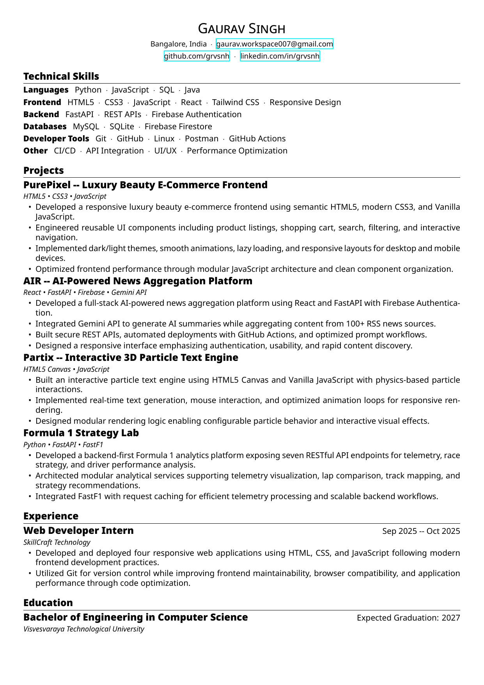

# 🚀 ResumeKit

ResumeKit is a modular, component-based LaTeX framework for building ATS-friendly, single-page resumes. It separates content, style, and configuration, allowing you to easily maintain, customize, and compile professional resumes.

---

## 🎨 Choose Your Theme

| Modern Theme | Minimal Theme | Academic Theme |
| :---: | :---: | :---: |
| [](assets/resume_modern.pdf) | [](assets/resume_minimal.pdf) | [](assets/resume_academic.pdf) |
| [📥 Download PDF](assets/resume_modern.pdf) | [📥 Download PDF](assets/resume_minimal.pdf) | [📥 Download PDF](assets/resume_academic.pdf) |

---

## ✨ Features

- **Single-Page by Default**: Automatically optimizes margins and item spacing for a strict, polished A4 one-page layout.
- **ATS-Friendly**: Standard LaTeX fonts and semantic components keep the resume readable for automated applicant tracking systems.
- **Zero-Clutter Workspace**: All compilation cache/logs go to the `build/` directory, while `resume.pdf` is outputted cleanly in the root folder.
- **Single Customization Entry**: Configure themes, fonts, accents, margins, and load profiles directly inside `main.tex`.

---

## 🛠️ How to Customize

All visual customizations and profile setups are centered in **[main.tex](main.tex)**:

```latex
% --- Customization Settings ---
\ResumeSetTheme{modern}      % Theme: modern, minimal, compact, academic
\ResumeSetFont{Noto Sans}    % Font: Any system font (e.g., Noto Sans, Inter, Roboto)
\ResumeSetDensity{compact}   % Spacing: compact, comfortable, relaxed
\ResumeSetAccent{black}      % Accent color: black, or Hex (e.g., 2563EB)

% Load profile information
\input{profiles/gaurav-singh.tex}
```

### Profile Data
Edit your contact details and social links in `profiles/gaurav-singh.tex`.

### Sections
Your resume sections are defined modularly in the `sections/` directory:
- `header.tex`: Rendered top-center with name and social links.
- `skills.tex`: Grouped skills (e.g., Languages, Frontend, Backend).
- `projects.tex`: Your key projects (loaded from `projects/` folder).
- `experience.tex`: Professional work history.
- `education.tex`: Educational qualifications.
- `certifications.tex`: Professional credentials.

---

## 🚀 Getting Started

### Prerequisites
Make sure you have `XeLaTeX` and `latexmk` installed:
- **Arch Linux**: `sudo pacman -S texlive-binextra texlive-fontsextra`
- **Ubuntu/Debian**: `sudo apt install texlive-xetex latexmk`
- **macOS (Homebrew)**: `brew install --cask mactex`

### Building the Resume
Run the following command in the root of the project:
```bash
latexmk -xelatex main.tex
```
This compiles the LaTeX source and outputs a polished **`resume.pdf`** directly to your root folder, keeping all other auxiliary build files hidden in `build/`.
