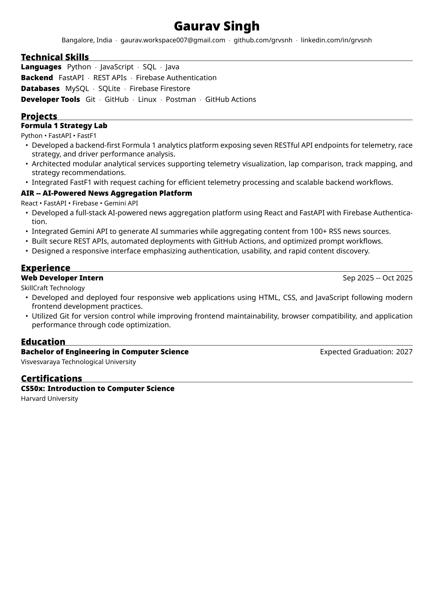
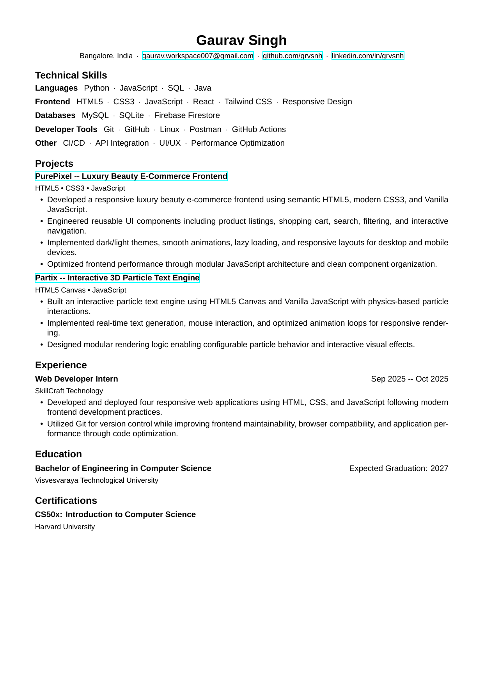
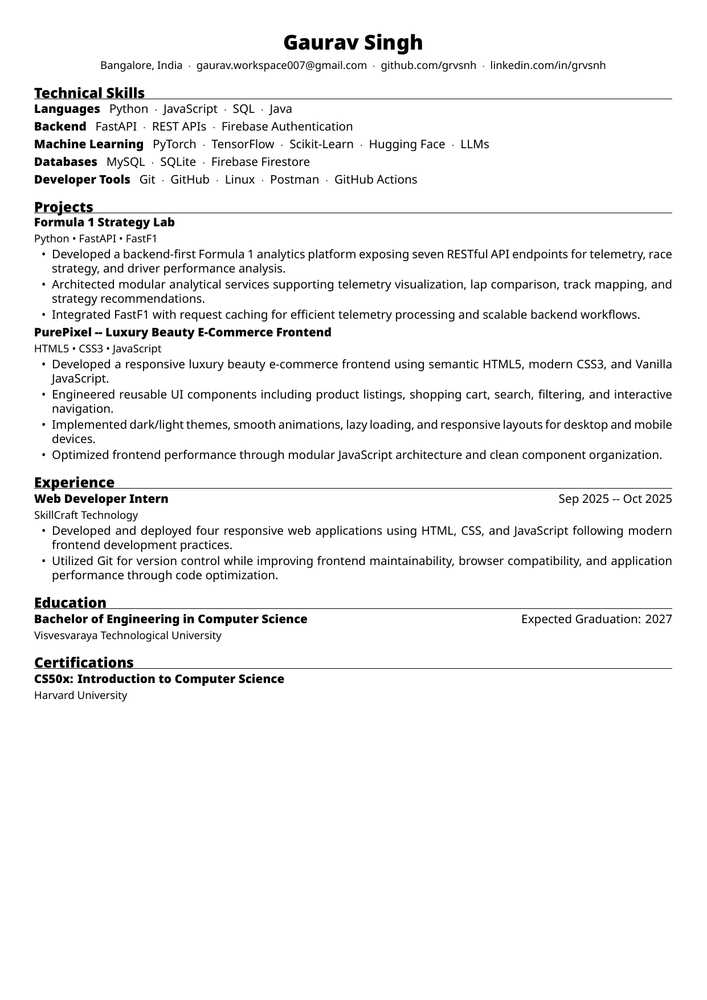

# 🚀 ResumeKit

ResumeKit is a modular, component-based LaTeX framework for building ATS-friendly, single-page resumes. I made this for myself to easily create different resume variants tailored for different roles without duplicating content. 

---

## 🎨 Themes & Roles

| Python Developer Role | Minimal Theme | Modern Theme |
| :---: | :---: | :---: |
| [](assets/resume_python.pdf) | [](assets/resume_minimal.pdf) | [](assets/resume_modern.pdf) |
| [📥 Download PDF](assets/resume_python.pdf) | [📥 Download PDF](assets/resume_minimal.pdf) | [📥 Download PDF](assets/resume_modern.pdf) |

---

## 🛠️ How it Works

1. **Configure Theme & Load Profile**: Everything is configured in **[main.tex](main.tex)**:
   ```latex
   \ResumeSetTheme{modern}      % modern, minimal, compact, academic
   \ResumeSetFont{Noto Sans}    % Any system font
   \ResumeSetDensity{compact}   % compact, comfortable, relaxed
   \ResumeSetAccent{black}      % Accent color
   \input{profiles/gaurav-singh.tex}
   ```
2. **Define Your Profile**: Make your own profile file inside the `profiles/` folder (e.g. `profiles/your-name.tex`).
3. **Define Reusable Components**: 
   * Add your projects as reusable tex files in `projects/`.
   * Add your skills grouped by category in `skills/`.
4. **Choose What to Include**: In `main.tex`, simply `\input` the specific projects and skills you want to show for a particular role, in any order you prefer.
5. **Build**: Run `latexmk -xelatex main.tex` to compile.
