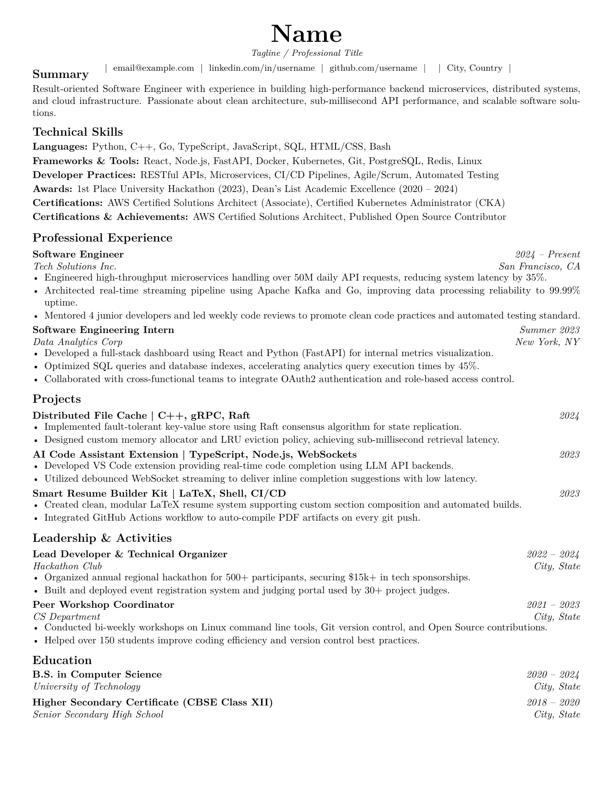

# ResumeKit 🚀

A modern, modular, ATS-optimized, **pure Black & White** LaTeX Resume Template system.

Features direct candidate setup in `resume.tex`, an auto-fetching `links/` folder system, zero-bullet clean contact formatting, elegant section rules, and dynamic 1-page auto-scaling (`\begin{fitpage}...\end{fitpage}`).



---

## ⚡ Direct Setup in `resume.tex` & `links/` Folder

### 1. Candidate Info inside [`resume.tex`](file:///home/grvsnh/Work/ResumeKit/resume.tex):

```latex
\documentclass{cv_template}

% Candidate Name & Tagline
\name{Name}
\tagline{Tagline / Professional Title}

% Set-and-Forget Links: Automatically fetches from links/
\email
\linkedin
\github
\location
```

### 2. Auto-fetching `links/` System:

Store your contact details/usernames inside individual files under `links/`:
- `links/linkedin.tex` -> `username`
- `links/github.tex` -> `username`
- `links/email.tex` -> `email@example.com`
- `links/website.tex` -> `website.com`
- `links/phone.tex` -> `+1 (555) 000-0000`
- `links/location.tex` -> `City, Country`

Simply invoke the macros in [`resume.tex`](file:///home/grvsnh/Work/ResumeKit/resume.tex):

```latex
\email
\linkedin
\github
\location
```

---

## 📁 Directory Architecture

```
ResumeKit/
├── resume.tex                   # Main document entry point
├── cv_template.cls              # Black & White LaTeX class with fitpage auto-scaling
├── README.md                    # Documentation & API reference
├── assets/                      # Preview assets
│   └── resume_preview.png       # Generated resume preview image
├── links/                       # Organised Link & Contact Files
│   ├── github.tex               # GitHub username
│   ├── linkedin.tex             # LinkedIn username
│   ├── email.tex                # Email address
│   ├── website.tex              # Portfolio URL
│   ├── phone.tex                # Phone number
│   └── location.tex             # Candidate location
└── sections/                    # Modular Content Components
    ├── summary/                # Executive Summary paragraph
    │   └── summary.tex
    ├── skills/                 # Technical Skills, Awards, Certifications & Achievements
    │   ├── skills.tex
    │   ├── awards.tex
    │   ├── certifications.tex
    │   └── achievements.tex
    ├── experience/             # Work experience entries
    │   ├── job1.tex
    │   └── job2.tex
    ├── projects/               # Technical project entries
    │   ├── project1.tex
    │   ├── project2.tex
    │   └── project3.tex
    ├── leadership/              # Leadership & extracurriculars
    │   ├── activity1.tex
    │   └── activity2.tex
    └── education/              # Academic & school entries
        └── education.tex
```

---

## 🛠️ Building

```bash
pdflatex -interaction=nonstopmode -halt-on-error resume.tex
```
